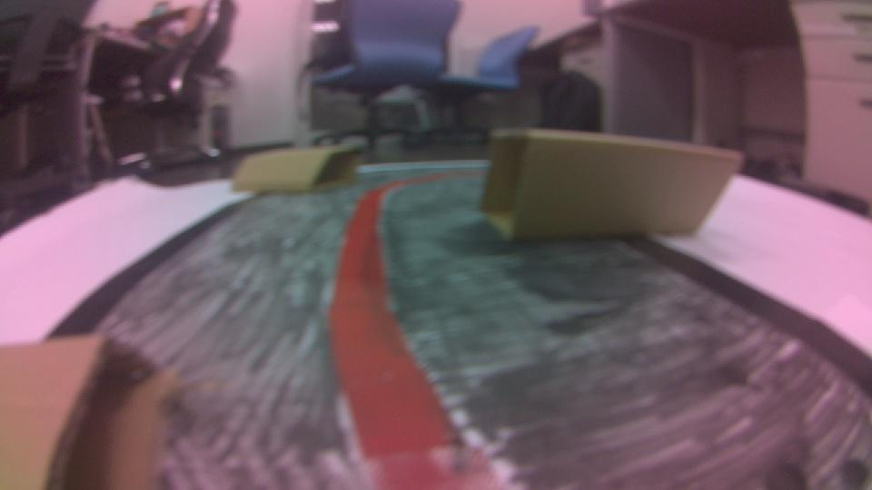
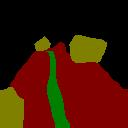

# Road-Segmentation
Road segmentation using
Jetbot's Road segmentation model

We using mobilenet-v3 to train the ROAD LANE Dataset first.
After training , we finetune on the real jetbot Dataset Label by labelme.

# Dataset
## Roadlane Dataset
```
https://www.kaggle.com/datasets/sovitrath/road-lane-segmentation-train-test-split
```

### Directory structure
```
data
|---roadlane
|   |---train
|   |   |---images
|   |   |---masks
|   |---val
|       |---images
|       |---masks
|---label
    |---fine_tune
        |---images
        |---masks
```


### Directory structure
```
data
|---labelme
    |---data_annotated
    |   |---<image 0>.jpg
    |   |---<image 0>.json
    |   |---...
    |---data_dataset_voc
    |   |---JPEGImages
    |   |---SegmentationClass
    |   |---SegmentationClassNpy
    |   |---SegmentationClassVisualization
    |   |---class_names.txt
    |---labels.txt
```

### Result

